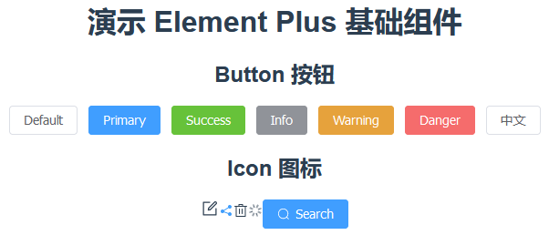

# 项目核心搭建步骤

## 1 安装相关的依赖包

```bash
npm i element-plus
npm i -D unplugin-vue-components unplugin-auto-import unplugin-icons
```

## 2 配置相关的依赖项

配置文件 `vue.config.js`：

```javascript
const { defineConfig } = require("@vue/cli-service");
const AutoImport = require("unplugin-auto-import/webpack");
const Components = require("unplugin-vue-components/webpack");
const { ElementPlusResolver } = require("unplugin-vue-components/resolvers");
const Icons = require("unplugin-icons/webpack");
const IconsResolver = require("unplugin-icons/resolver");
const path = require("path");

module.exports = defineConfig({
  transpileDependencies: true,
  configureWebpack: (config) => {
    config.plugins.push(
      ...[
        AutoImport({
          resolvers: [ElementPlusResolver()],
          dts: path.resolve(process.cwd(), "src/auto-imports.d.ts")
        }),
        Components({
          resolvers: [ElementPlusResolver(), IconsResolver()],
          dts: path.resolve(process.cwd(), "src/components.d.ts")
        }),
        Icons({
          autoInstall: true
        })
      ]
    );
  }
});
```

## 3 编写测试用代码行

编码文件 `App.vue`：

- 演示 Button 按钮：

```vue
<el-button>Default</el-button>
<el-button type="primary">Primary</el-button>
<el-button type="success">Success</el-button>
<el-button type="info">Info</el-button>
<el-button type="warning">Warning</el-button>
<el-button type="danger">Danger</el-button>
<el-button>中文</el-button>
```

- 演示 Icon 图标：

```vue
<el-icon :size="20">
<i-ep-edit />
</el-icon>
<el-icon class="no-inherit" color="#409EFC">
<i-ep-share />
</el-icon>
<el-icon>
<i-ep-delete />
</el-icon>
<el-icon class="is-loading">
<i-ep-loading />
</el-icon>
<el-button type="primary">
<el-icon style="vertical-align: middle">
  <i-ep-search />
</el-icon>
<span style="vertical-align: middle"> Search </span>
</el-button>
```

## 4 运行项目查看结果


